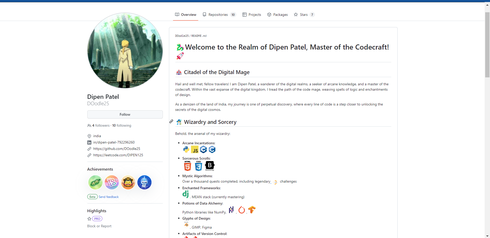

# 🐉 Welcome to the Realm of Dipen Patel, Master of the Codecraft!! 🚀

## 🏰 Citadel of the Digital Mage

Hail and well met, fellow travelers! I am Dipen Patel, a wanderer of the digital realms, a seeker of arcane knowledge, and a master of the codecraft. Within the vast expanse of the digital kingdom, I tread the path of the code mage, weaving spells of logic and enchantments of design.

As a denizen of the land of India, my journey is one of perpetual discovery, where every line of code is a step closer to unlocking the secrets of the digital cosmos.

## 🧙‍♂️ Wizardry and Sorcery

Behold, the arsenal of my wizardry:

- **Arcane Incantations**:     
- **Sorcerous Scrolls**:   
- **Mystic Algorithms**: Over a thousand quests completed, including legendary  challenges
- **Enchanted Frameworks**: , MEAN stack (currently mastering)
- **Potions of Data Alchemy**: Python libraries like NumPy, </a> ,  , <a target="_blank" rel="noopener noreferrer nofollow" href="https://camo.githubusercontent.com/008f20e996511a8c19cea632dccfb69bd00613935b3fea3b36ce75c486713573/68747470733a2f2f7777772e766563746f726c6f676f2e7a6f6e652f6c6f676f732f74656e736f72666c6f772f74656e736f72666c6f772d69636f6e2e737667">
- **Glyphs of Design**:  , GIMP, Figma
- **Artifacts of Version Control**: , Hub, VS Code
- **Realict Storages:**:  , 
- **Relics of the Ancients**: MS Word, MS PowerPoint, and other arcane tools

## ⚔️ Quests and Pursuits

My quest is one of innovation and creation, where the melding of technology and design shapes the destiny of the digital realm. My sights are set on the distant horizons of AI/ML and data science, where the arcane mysteries of data await to be unraveled.

## 📜 Past Wizard Academies

In the annals of time, my journey began in the hallowed halls of MS University Baroda(2020-2021). There, amidst the incantations of design and the sorcery of art, I honed my skills and crafted my first spells.

But as the moons waxed and waned, I felt the call of a greater adventure. With a heart afire with curiosity and a thirst for deeper knowledge, I embarked on a new quest—to delve into the ancient lore of logic and algorithmic wizardry.

- **Legendary Quests Completed**: 
    - CS50 and CS50 Web (2022-2023)
    - Cisco courses on C++ and cybersecurity
    - NPTEL software engineering saga

## 🏆 Quests and Triumphs

Venture forth into my repository chambers, where tales of valor and triumph await:

- **Epic Hackathons**: Battle-tested and victorious, I have claimed rare treasures, including a domain name and the prestigious GitHub Pro subscription.
- **Academic CHronicles**: Completed the legendary CS50, CS50 Web, and Cisco Courses, alongside the NPTEL software engineering saga
- **Projects of Legend**: Explore the artifacts of my creation, from web citadels to algorithmic conquests.

## 🔗 Join My Fellowship!

Are you prepared to embark on epic quests, engage in arcane debates, or simply share tales of your own adventures? Take heed, and join me on [LinkedIn]([#](https://www.linkedin.com/in/dipen-patel-792296260/)) and [Twitter](https://twitter.com/DIPENPA08441275) and [leetcode](https://leetcode.com/u/DIPEN125/) , or send word via electronic raven to [pdipen135@gmail.com](mailto:example@example.com).

Together, let us forge a path through the digital wilderness and carve our names into the annals of history! 🌌

# Old account
- my previous account was compromised in invalid Suspension by github recovery in process:(www.github.com/DOodle25)

